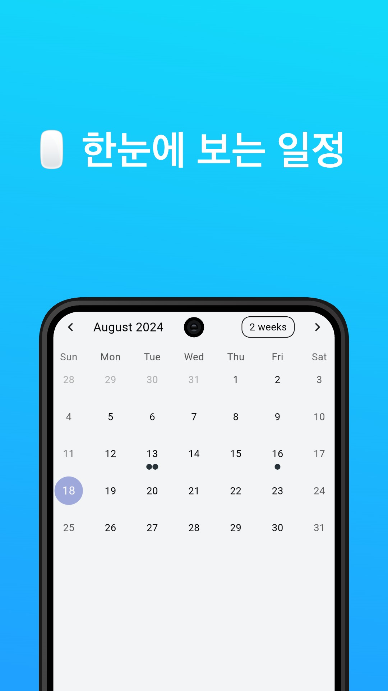
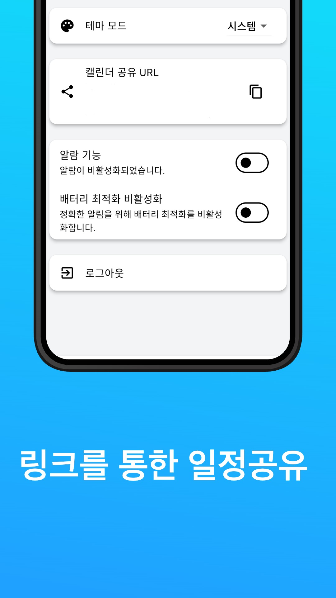
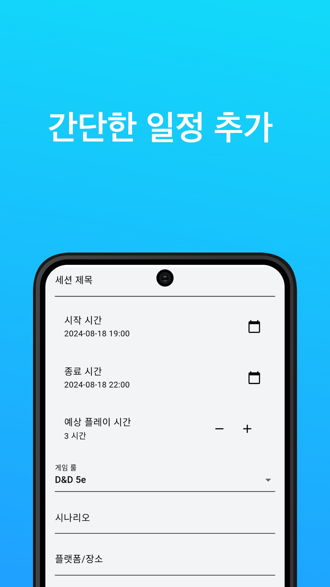

# TRPG 세션 플래너

TRPG 세션 플래너는 테이블톱 롤플레잉 게임(TRPG) 세션을 효과적으로 관리하고 공유할 수 있는 크로스 플랫폼 애플리케이션입니다. 웹과 안드로이드 플랫폼을 지원하며, 사용자들이 세션을 쉽게 계획하고, 참가자들과 정보를 공유하며, 일정을 관리할 수 있도록 도와줍니다.

  

## 주요 기능

- 캘린더 기반의 세션 관리
- 세션 생성, 수정, 삭제 기능
- 실시간 데이터 동기화
- 세션 공유 기능 (고유 URL 제공)
- 알림 기능 (모바일 앱)
- 다크/라이트 테마 지원

## 기술 스택

- **프론트엔드**: Flutter
- **백엔드**: Firebase (Authentication, Firestore, Cloud Storage, Cloud Messaging)
- **상태 관리**: ChangeNotifier

## 주요 구현 사항

1. **크로스 플랫폼 개발**: 
   Flutter를 사용하여 웹과 안드로이드 플랫폼에서 동작하는 애플리케이션을 개발했습니다. 플랫폼별 차이를 고려한 조건부 렌더링 및 예외 처리를 구현했습니다.

2. **실시간 데이터 동기화**: 
   Firebase Realtime Database를 활용하여 세션 정보가 실시간으로 업데이트되도록 구현했습니다.

3. **사용자 인증**: 
   Firebase Authentication을 사용하여 이메일/비밀번호, 구글 로그인, 익명 로그인을 구현했습니다.

4. **세션 공유**: 
   고유 URL을 생성하여 사용자가 자신의 세션 일정을 다른 사람과 쉽게 공유할 수 있도록 했습니다.

5. **알림 기능**: 
   Firebase Cloud Messaging을 사용하여 모바일 앱에서 예정된 세션에 대한 알림을 제공합니다.

